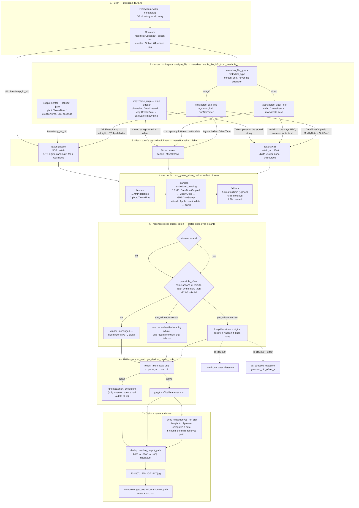

# How a capture date is derived

From the bytes on disk to the name on the output file.

The archive's layout is a wall clock — `2024/07/15/1430-22417.jpg` — so the only
question a date source has to answer is *what digits go in the path*. Everything
below is in service of that, and [`metadata::taken::Taken`](../src/metadata/taken.rs)
is where the answer is carried: `local` are the digits, `certain` says whether
they are the reading the photographer saw, and `offset` records the zone when a
source stated one. Only `local` reaches the path.

## Notes

- **The path never goes through a string.** `get_desired_media_path` takes the
  `Taken` and formats `local`. `best_guess_taken_dt` still produces RFC 3339, but
  only for the note and the index.
- **`guessed_utc_offset_s` is how the index stays honest.** `guessed_datetime`
  writes `+00:00` on a reading whose zone nobody recorded; a NULL offset beside
  it is what says that suffix is a placeholder rather than a reading.
- **`undated/` now means exactly one thing** — no source had a date. It used to
  also catch a date that failed to survive being parsed back out of a string.
- **What is still unrepairable:** a file whose only date is its mtime, and a
  Takeout export whose embedded date was stripped. Both file under UTC digits,
  which is what an `--assume-timezone` option would be for.
