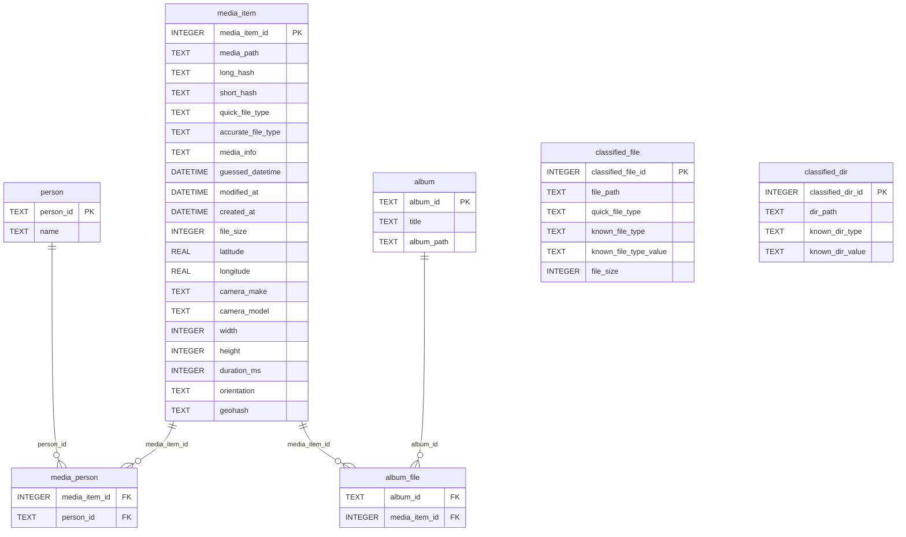

# Database schema

<!-- Generated by the `db_schema_docs` test from the `CREATE TABLE` statements in `db_cmd.rs`. -->
<!-- Do not edit by hand. Run `UPDATE_DOCS=1 cargo test` to regenerate. -->

```mermaid
erDiagram
    media_item ||--o{ media_person : "media_item_id"
    person ||--o{ media_person : "person_id"
    album ||--o{ album_file : "album_id"
    media_item ||--o{ album_file : "media_item_id"
    media_item {
        INTEGER media_item_id PK
        TEXT media_path
        TEXT long_hash
        TEXT short_hash
        TEXT quick_file_type
        TEXT accurate_file_type
        TEXT media_info
        DATETIME guessed_datetime
        DATETIME modified_at
        DATETIME created_at
        INTEGER file_size
        REAL latitude
        REAL longitude
        TEXT camera_make
        TEXT camera_model
        INTEGER width
        INTEGER height
        INTEGER duration_ms
        TEXT orientation
        TEXT geohash
    }
    person {
        TEXT person_id PK
        TEXT name
    }
    media_person {
        INTEGER media_item_id FK
        TEXT person_id FK
    }
    album {
        TEXT album_id PK
        TEXT title
        TEXT album_path
    }
    album_file {
        TEXT album_id FK
        INTEGER media_item_id FK
    }
    classified_file {
        INTEGER classified_file_id PK
        TEXT file_path
        TEXT quick_file_type
        TEXT known_file_type
        TEXT known_file_type_value
        INTEGER file_size
    }
    classified_dir {
        INTEGER classified_dir_id PK
        TEXT dir_path
        TEXT known_dir_type
        TEXT known_dir_value
    }
```
